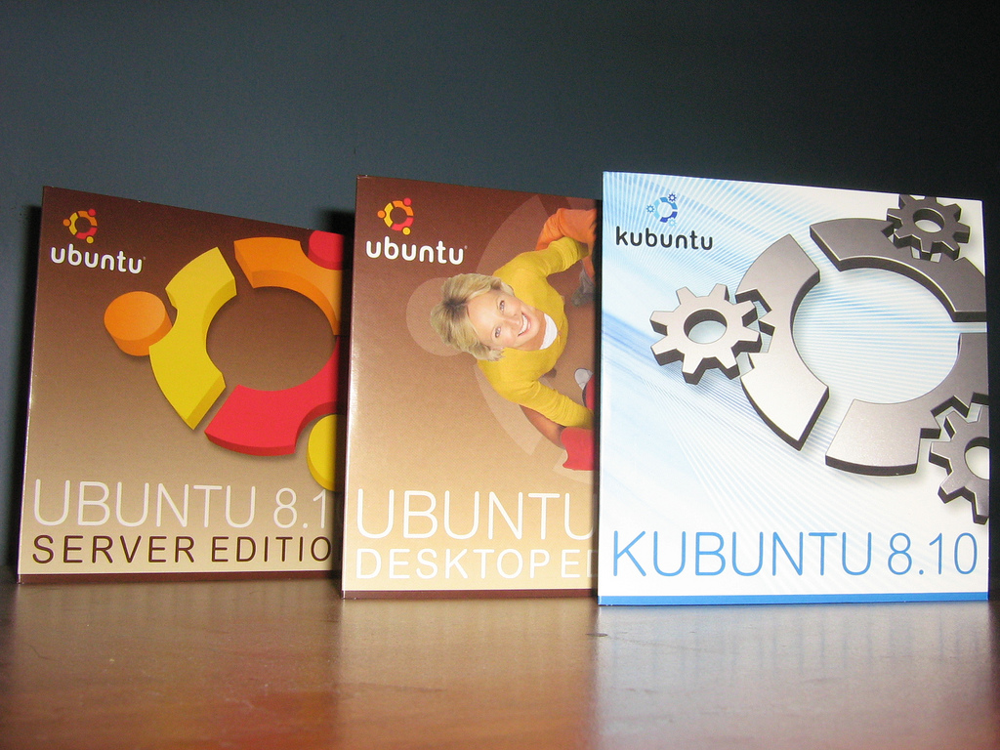
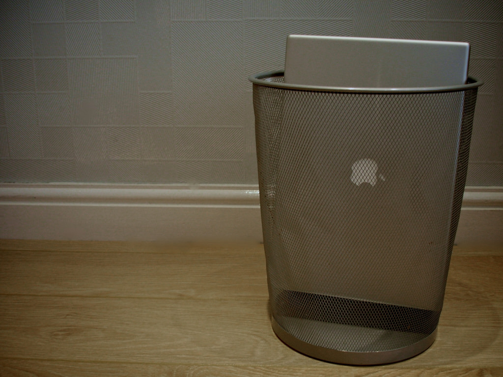
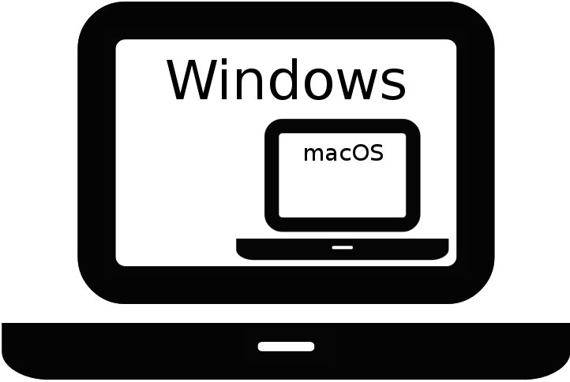
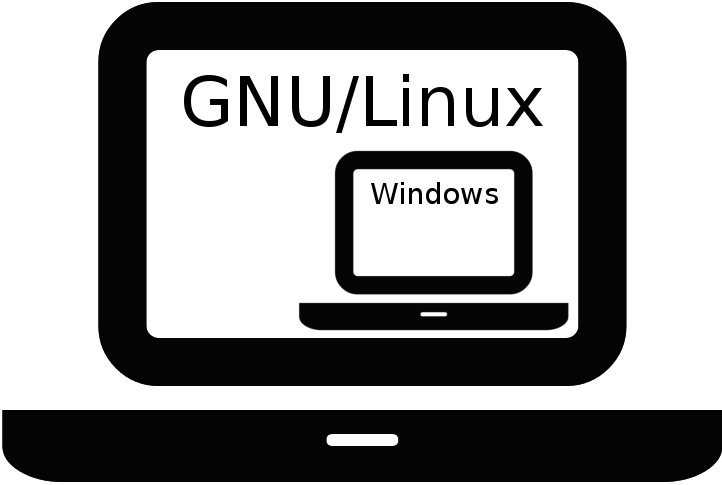
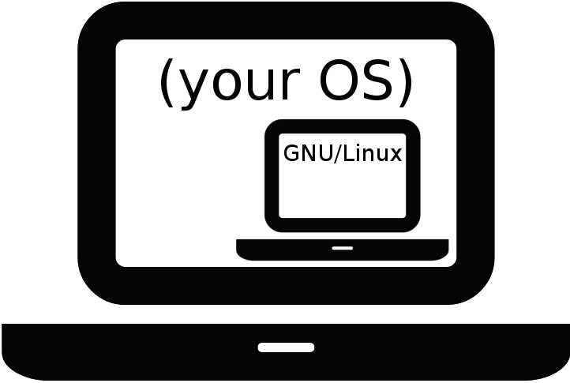

???

The goal of this course is to improve familiarity with Unix-like operating
systems. Before we begin, though, we should ask: why do Unix-like operating
systems matter?

---

# Why "Unix-like"?


"macOS Sierra" is copyright Apple, Inc. Used with permission.

???

Chances are, you're running a Unix-like system right now. The popular Apple
macOS is Unix-like. (Actually, since version 10.5--code named "Leopard"--OSX
hasn't just been "Unix-like," [it's officially fully
Unix](http://www.opengroup.org/openbrand/register/brand3555.htm). This
distinction probably doesn't mean much right now; :chapter:history: has more
details.)

If you're running Mac OSX, the concepts we cover here will be directly
applicable to your day-to-day computing.

---

:continued:



"[Discos de Ubuntu 8.10 (Intrepid
Ibex)](https://www.flickr.com/photos/sir_gon/3113641967/)" by [Gonzalo
Díaz](https://www.flickr.com/photos/sir_gon/) is Licensed under [CC BY
2.0](https://creativecommons.org/licenses/by/2.0/)

???

GNU/Linux is another world-famous Unix-like operating system. Popular variants
include Debian, Redhat, and Ubuntu (pictured).

While GNU/Linux is not as common on the desktop as Microsoft Windows or Apple
macOS, it is widely deployed in server technology. Professionals working in the
field of software development (especially for web-based technologies) will
likely come across this operating system in the course of deploying their work.

---

# User-unfriendly



"[Schlock. Manchester,
England](https://www.flickr.com/photos/ndm007/171398958/)" by [Nathan
Makan](https://www.flickr.com/photos/ndm007/) is licenced under [CC BY-NC-ND
2.0](https://creativecommons.org/licenses/by-nc-nd/2.0/)

???

Many aspects of using Unix and its derivatives are non-obvious, and some are
downright confusing. We hope to help students understand the fundamentals so
that they can begin to feel more comfortable:

- working from a text-based command prompt
- using essential utility applications
- composing custom scripts to automate work and solve problems
- perform basic system administration tasks

Whenever possible, we try to explain the rationale behind the system design so
that students will not have to rely on rote memorization to build confidence.

---

# Reading the Code Examples

```terminal
pc$ code blocks like these represent a terminal
they are intended to demonstrate various commands
and their effects
pc$ 
```

???

Lines that begin with `pc$` describe commands that are intended to be entered
into your system's terminal. The `pc$` is sometimes referred to as the
"prompt", and it is intended to designate input lines. The "command" is all
the text that follows the prompt; when typing the command on your system, you
should not include the prompt.

Lines that do not begin with the prompt are "output" lines. This is text
produced in response to the command.

Note that terminal examples from other guides use the lone dollar sign
character (`$`) or even the "hash" character (`#`) as the prompt. Whatever it
looks like, the prompt's purpose is the same: to designate the command that
should be typed.

---

:continued:

<div class="img-3">
  
  
  
</div>

???

Complete operating systems can be run as standalone processes. These are known
as "virtual machines," and you can use them to run any operating system within
any other operating system.

A GNU/Linux virtual machine (specifically, of [the Ubuntu
distribution](http://ubuntu.com/)) has been prepared for this course. This
means that regardless of the operating system you are using today, you will
experiment and learn inside the exact operating system that the course
requires.

---

:continued:

```terminal
pc$ this command should be run on your system
this is output from your system

vm$ this command should be run in the virtual machine
this is output from the virtual machine
```

???

A small number of commands in this course are intended to be run on your
system, but most of them should be executed within the virtual machine.

The `pc$` prompt denotes commands that are intended to be run on your system.
We'll use the `vm$` prompt to denote the commands that are intended for the
virtual machine.

---

# A note on shells

Executable | Name                  | Year Created
-----------|-----------------------|-------------
`bash`     | Bourne-again shel l   | 1989
`csh`      | C shell               | 1978
`dash`     | Debian Almquist shell | 1997
`ksh`      | Korn shell            | 1983
`sh`       | Bourne shell          | 1977
`tcsh`     | TENEX C shell         | 1981
`zsh`      | Z shell               | 1990

???

The terms of Unix-like systems, the word "**shell**" refers to any program that
provides a text interface to the system. There are *many* shell applications
available (this is just a partial list), and they differ substantially.

Because all interaction is mediated by the shell (:chapter:command-invocation:
has a more complete discussion of this), the distinction between features
provided by the system and features provided by the shell can be subtle.

This course focuses on system-provided functionality because that is relevant
regardless of one's chosen shell. Whenever course content describes
shell-provided functionality, this distinction is explicitly described. In
these cases, content is limited to the feature set that is shared by the more
common shells: `bash`, `sh`, and `zsh`.

Students who are interested in using shell-specific features have advanced
beyond the abilities of this course's target audience.

---

# About the exercises

<div class="img-3">
  
  
  
</div>

"[Vagrant Logo](https://commons.wikimedia.org/w/index.php?curid=29324827)" by
[Fco.plj](https://commons.wikimedia.org/w/index.php?title=User:Fco.plj) is
licensed under [CC BY-SA 3.0](http://creativecommons.org/licenses/by-sa/3.0)

???

In order to provide a consistent experience for all students across all
platforms, interactive exercises for this course are authored to be completed
within a "virtual machine." Thanks to the free and open source software
[VirtualBox](https://www.virtualbox.org/),
[Vagrant](https://www.vagrantup.com/), and [Ubuntu](http://www.ubuntu.com/),
students can complete the exercises in a purpose-built Unix-like environment
using their personal computer and at no charge. :chapter:setup: includes
instructions for installing these tools.

The default user account in the exercise environment is named "vagrant", and it
is configured to use the Bash shell. Administrative access requires a password,
and that password is "vagrant".

---

# About the course

Command the Command Line was created in 2016 at [Bocoup](https://bocoup.com).
It is currently maintained by [Mike Pennisi](https://mikepennisi.com).
