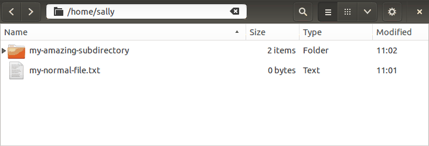

???

- Your terminal is always located "inside" some directory on the file system.
- Your current location influences how many commands are interpreted, so it's
  important to know where you are!
- In this section, we'll cover a few tools to learn our location and move
  around.

---


"[Stacked papers in folder](https://www.flickr.com/photos/auxesis/2965102907/)"
by [Lindsay Holmwood](https://www.flickr.com/photos/auxesis/) is licensed under
[CC BY 2.0](https://creativecommons.org/licenses/by/2.0/).

???

The file system is defined by a hierarchy of "directories". A directory can
contain any number of directories (known as "**sub-directories**"). For the
most part, each directory is itself contained within exactly one directory;
this is known as the "**parent directory**".

These concepts are likely familiar because they are also featured in many GUI
applications like Windows Explorer and Apple's Finder. The sample commands in
this section will be be supported by recordings of equivalent operations
performed with a graphical interface (specifically, [the GNOME
Files](http://live.gnome.org/Nautilus) file manager).

---

```terminal
Path:         /top-level/sub-directory/another directory!/
              |         |             |                  |
--------------+---------+-------------+------------------+
              |         |             |                  |
              |         |             |                  |
Directories:   top-level              |                  |
                         sub-directory                   |
                                       another directory!
```

???

On Unix-like systems, the forward slash character (`/`) separates directory
names. This means that the forward slash character cannot be used in a
directory name, but everything else is fair game.

The example above describes a path where `top-level` is a directory that
contains `sub-directory`. Inside `sub-directory` is a third directory named
`and another!` (yes: the name includes the space character and the exclamation
mark).

---

```terminal
vm$ 
```

???

- On the command line, though, it's not always clear where we are. 
- By the way: in this course, we'll use the dollar sign (`$`) to indicate a
  command prompt.
- This notation is commonly used in software documentation, but it is only
  convention; there is nothing special about the dollar sign.
- Importantly, you should *not* include it when you copy commands from the web
- In any case, there are a few essential tools for getting our bearings.

---

# `pwd`

## Print the current (i.e. "working") directory

```terminal
vm$ pwd
/home/sally
vm$ 
```

In a GUI:


???

- The `pwd` command writes the terminal's current directory to the screen.
- This is an acronym for "print working directory"
- This information is so important that many people customize their command
  prompt to include it. We'll discuss customization later.
- In this example, we are in the "**home directory**" of the user named
  "sally". The home directory is a location reserved for your user account (new
  terminal windows typically start here).

---

# `ls`

## List directory contents

```terminal
vm$ pwd
/home/sally
vm$ ls
my-amazing-subdirectory
my-normal-file.txt
vm$ 
```

In a GUI:


???

- The `ls` utility lists the contents of a directory--this includes files and
  sub-directories
- Without any arguments, it shows the content of the current directory

---

:continued:

```terminal
vm$ ls my-amazing-subdirectory
oh-boy-another-directory
just-another-file.txt
vm$ 
```

In a GUI:



???

When invoked with a path to another directory, `ls` will display the contents
of that directory.

---

# `cd`

## Change directories

```terminal
vm$ cd my-amazing-subdirectory
vm$ pwd
/home/sally/my-amazing-subdirectory
vm$ 
```

In a GUI:


???

- `cd` allows us to move around inside the directory structure
- `cd` stands for "change directory" and it accepts a path that is our
  destination
- In this example, we're moving to a subdirectory named
  `my-amazing-subdirectory`. The output of `pwd` changes to reflect this.
- Any guesses for what happens when we try to `cd` into a file?

---

:continued:

```terminal
vm$ ls
oh-boy-another-directory
just-another-file.txt
vm$ cd just-another-file.txt
cd: just-another-file.txt: Not a directory
vm$ cd this-directory-doesnt-exist
cd: this-directory-doesnt-exist: No such file or directory
vm$ 
```

In a GUI:


???

Notice that we cannot move into a file or into a location that doesn't exist.

---

:continued:

```terminal
vm$ pwd
/home/sally
vm$ cd my-amazing-subdirectory/oh-boy-another-directory
vm$ pwd
/home/sally/my-amazing-subdirectory/oh-boy-another-directory
vm$ 
```

???

...and as discussed earlier, the forward slash character (`/`) separates
directory names.

---

# Going `$HOME`

```terminal
vm$ pwd
/home/sally/my-amazing-subdirectory/oh-boy-another-directory
vm$ cd ~
vm$ pwd
/home/sally
vm$ cd ~/my-amazing-subdirectory/oh-boy-another-directory
vm$ pwd
/home/sally/my-amazing-subdirectory/oh-boy-another-directory
vm$ 
```

???

The tilde character (`~`) is a shorthand for "my home directory." You don't
have to use it all by itself; it can be used as part of a path, too.

---

# Backing up


"[Stuck Car](https://www.flickr.com/photos/beigephotos/3663149/)" by [Michael
Pereckas](https://www.flickr.com/photos/beigephotos/) is licensed under [CC
BY-SA 2.0](https://creativecommons.org/licenses/by-sa/2.0/)

???

We've learned how to dive into a directory, but we're kind of stuck once we get
there. Fortunately, there is a consistent method for referencing "the parent
directory."

---

:continued:

```terminal
vm$ pwd
/home/sally/my-amazing-subdirectory/oh-boy-another-directory
vm$ cd ..
vm$ pwd
/home/sally/my-amazing-subdirectory
vm$ 
```

In a GUI:


???

Two period characters (`..`) signify "the directory above."

---

:continued:

```terminal
vm$ pwd
/home/sally/my-amazing-subdirectory
vm$ cd ../../sally
vm$ pwd
/home/sally
vm$ 
```

???

This works just like any other directory name, so it can be used anywhere you
can write a path.

---

:continued:

```terminal
vm$ pwd
/home/sally
vm$ cd ../..
vm$ pwd
/
vm$ cd ..
vm$ pwd
/
vm$ 
```

???

The hierarchy of files is sometimes referred to as a "tree" because of the way
directories and sub-directories tend to "branch out" from the center. Continuing
this metaphor, the top-most directory is commonly referred to as the **root
directory**. We can't move any higher in the file system than the root.

---

# Paths from the root? Absolutely!


"[rooted-path](https://www.flickr.com/photos/devlon/24055969569/)" by
[Devlon Duthie](https://www.flickr.com/photos/devlon/) is licensed under [CC
BY-NC 2.0](https://creativecommons.org/licenses/by-nc/2.0/).

???

- Up until now, all the paths we've used have been based on the current working
  directory.
- It's also possible to specify a path regardless of our current
  location.

---

:continued:

```terminal
vm$ pwd
/home/sally
vm$ cd /home
vm$ pwd
/home
vm$ cd /home/sally/my-amazing-subdirectory
vm$ pwd
/home/sally/my-amazing-subdirectory
vm$ 
```

???

A paths which begins with a forward slash character (`/`) is known as an
"**absolute path**". It describes the same location regardless of where we are
when we use it.

---

# `tree`

## Display directories and their contents

```terminal
vm$ tree
.
├── my-amazing-directory
│   └── just-another-file.txt
└── my-normal-file.txt

1 directory, 2 files
vm$ 
```

???

- `tree` is a powerful tool for visualizing files, directories, and their
  relationships.
- It uses a text-based "tree" diagram
- It is not included in all systems by default, so you may need to install it
  yourself

---

# Inspecting files


"[Not legal tender](https://www.flickr.com/photos/skycaptaintwo/3128797505/)"
by [skycaptaintwo](https://www.flickr.com/photos/skycaptaintwo/) is licensed
under [CC BY-NC 2.0](https://creativecommons.org/licenses/by-nc/2.0/).

???

Directories are great for organization, but most of our work concerns files.
Lets take a look at some tools for learning about files and their contents.

---

# `cat`

## Display file contents (all at once)

```terminal
vm$ ls
oh-boy-another-directory
just-another-file.txt
vm$ cat just-another-file.txt
This is the first line of just-another-file.txt
This is the second line of the file!
The file only has three lines, and this is the last one!
vm$ 
```

???

- The `cat` utility has a lot of uses (its name is short for "concatenate"),
  but the simplest use is for displaying file contents.
- One problem here is that all the content gets "dumped" to the screen. This
  means `cat` isn't very useful for files with more than a few lines.

---

# `less`

## Display file contents (with navigation controls)

```terminal
vm$ less a-longer-file.txt
This is the content of a-longer-file.txt, but only
just enough of it to fill the screen. You can use
the "up" and "down" arrow keys in the terminal to
scroll through the whole file. Press the `q` key
to quit.
```

???

The `less` utility provides a way to review the contents of a large file. It
has a lot of special controls, but the most important ones are:

- "Up" arrow key, "PageUp" key: scroll upwards
- "Down" arrow key, "PageDown" key: scroll downwards
- `h` key: help
- `q` key: exit

---

# `sort`

## Re-order input

```terminal
vm$ cat just-another-file.txt
This is the first line of just-another-file.txt
This is the second line of the file!
The file only has three lines, and this is the last one!
vm$ sort just-another-file.txt
The file only has three lines, and this is the last one!
This is the first line of just-another-file.txt
This is the second line of the file!
vm$ 
```

???

As you might expect from the name, the `sort` utility sorts its input by line
and displays the result.

---

# In Review

- Paths
  - The forward slash character (`/`) is the path separator
  - Two periods (`..`) denote "the parent directory"
  - The "root" directory is the topmost directory on the file system; it's
    name is simply `/`
  - The tilde character (`~`) denotes "my home directory"
- Utilities
  - `pwd` - display the current directory ("**p**rint **w**orking
    **d**irectory")
  - `cd` - navigate to another directory ("**c**hange **d**irectory")
  - `ls` - **l**i**s**t contents
  - `cat` - display file contents ("con**cat**enate")
  - `less` - display file contents with controls
  - `sort` - re-order the lines of a file and display the results
  - `tree` - display files within a directory and its children in a visual manner
